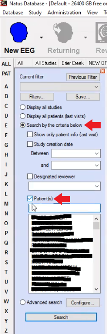
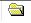
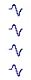
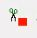

**Follow:**

[https://citrix.duke.edu/Citrix/DukeWeb/](https://citrix.duke.edu/Citrix/DukeWeb/)

***Clipping and exporting EDFs is a slow process- allow all windows to fully load before continuing each step***

Once logged into NATUS, wait for file synchronization to fully complete (loading bar is located at lower right side of window)

**Locating Patient files****:**

By pressing the "Search" icon or using the search bar on the left, only **select areas** indicated by red arrows, **enter pt name**, **search.**

Once results have fully loaded:

1.  Sort files by "Start time" so that most recent files are at the top.
2.  Press  to sort by file type 

O**riginal** data files       Clipped data files   

*Make sure to extract from ORIGINAL data files only*

Refer to **Neurology_TaskData_Timestamps.slxs** on box for tasks/dates/times 

EDFs are recorded in 24hr epochs- select 24hr window in which specific task occurred using "Start time" and "End time"

     *You cannot clip from a live EDF recording. Icon must be blue- shown above. If red, recording is live. 

Double click to open

_____________________________________________________________________________________________________________________________________________________________________________________________________________________________________________________________________________________________________

**Clipping EDF:**

Shown below is the NATUS screen:

*   The **top** box and arrow indicate the **date and time** of day selected
*    The **bottom** box and arrow show the **time bar**

By clicking along the **time bar** you can select a specific time- refer to **Neurology_TaskData_Timestamps.slxs** for start and end times

*   Once desired **start** time has been reached, select  icon to begin clip

Once the play icon is pressed, a window will pop up:

 

*   In Note Details type **'D## taskdate COGAN_TASKNAME'** and hit OK

Navigate along the bottom time bar to the desired **end time** and press  to end clip

Time bar should now show yellow indication of clipped area

Clipped area must now be pruned and extracted.

_____________________________________________________________________________________________________________________________________________________________________________________________________________________________________________________________________________________________________

**Pruning the Clip:**

Press  to prune the clip you just created

A window should pop up

 

*   *Multiple clips may automatically be selected. 
*   *Make sure to select ONLY the clip you just created- do this by double checking start and end times
*   *Only prune one task clip at a time
*   *Uncheck box in camera column- **ONLY scissors box** should be selected  

*   Press "Prune..." button

A window should pop up

*   The Study Name should match the input from 'note details' entered earlier- double check to make sure **D#, taskdate, task** are correct
*   Press 'Ok'- this will take about 15 minutes to complete.

Once complete, press 'Ok' and then 'Close' the pruning window

Close out of the current NATUS window.
When prompted, click 'Yes' to save changes

Once back at the patient window, organize by "Study Name"

*   The files just pruned should be visible    

_____________________________________________________________________________________________________________________________________________________________________________________________________________________________________________________________________________________________________

**Deidentify and Exporting:**

*EDF cannot be exported to local drive, can only be exported to network drive.

Right click on desired file and select 'Export'

A window will pop up:

*   Select EDF/EDF+
*   Select destination for file to save to 
*   Right click on file under 'Template' and select 'Edit Template...'

A window will pop up:

 

*   Name: DEIDENTIFIED EDF 
*   Select:

*   'Options' tab
*   EDF+
*   Deidentify patient information    

*   Unselect 'Invert AC channels' 
*   Press 'Ok' 

Press 'Export' 

Once file has exported to network drive, rename in format "D# TaskDate COGAN_TASKNAME.edf

Upload to box **Box Sync\CoganLab\ECoG_Task_Data\TaskUploadDir **

*TaskDate should be in format YYMMDD

____________________________________________________________________________________________________________________________________________________________________________________________________________________________________________________

**Archived EDF on NATUS**

To access older participant EDF on NATUS, follow previous instructions. Double click on desired EDF, when prompted with: 

The archive location should be auto-filled. Press 'Ok'.

A second window will pop up:

Select 'No'.

Continue with pruning and extraction instructions above. This should be the only difference when accessing archived EDF. 

________________________________________________________________________________________________________________________________________________________________________________________________________________________________________________________________________________________________

**Troubleshooting**

NATUS can be a fickle beast. Sometimes, for seemingly unknown reasons, it will fail to produce participant data from the search menu. In this case, close out of NATUS and Citrix and re-log-in. This *should* fix it. If not, you will need to submit an IT ticket.

 

 