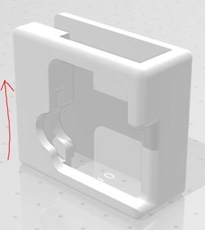

# Equipment
## Photodiode

1.  SM1A6
2.  SMA cable
3.  BNC connector
4.  3.5mm to BNC cable(peach cable) 

## Photodiode holder

1.  3D print file saved to S:\NSU\Lab_Cogan\PhotodiodeHolder_3DPrint
2.  For this holder design, it is recommended to print from the side: 

 

1.  Foam sheet will have to be cut and added as padding to the printed photodiode holder.  

## Microphone

## Audio Amplifiers

1. Fiio

   1. The speakers should be plugged into this amplifier
   2. Powered and connected via USB port
   3. The Audio Device manager should recognize this device as "Fiio" and should be set as Enabled and Default

2. Behringer 

   1. The microphone should be plugged into this amplifier
   2. Powered and connected via USB port
   3. The Audio device manager should recognize this device as "Behringer" and should be set as Enabled