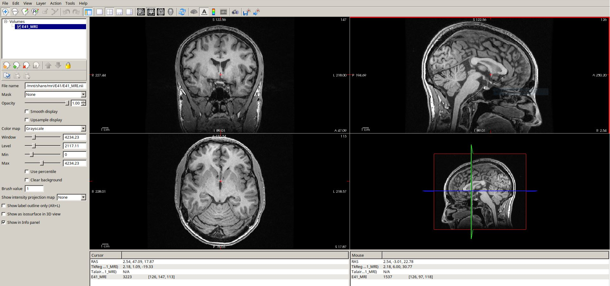
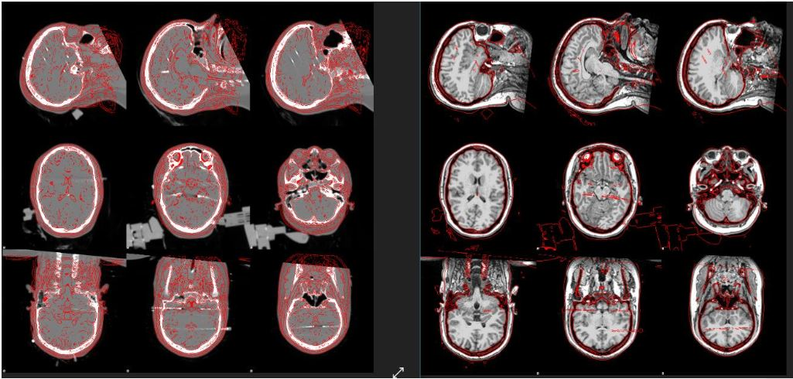
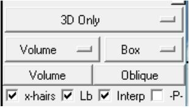
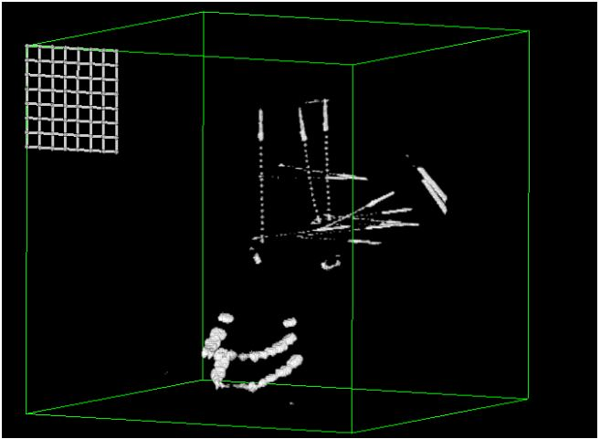
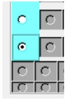
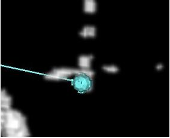
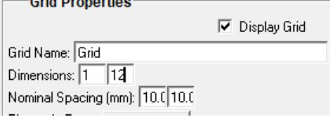
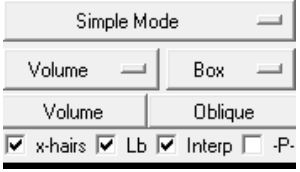
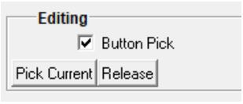
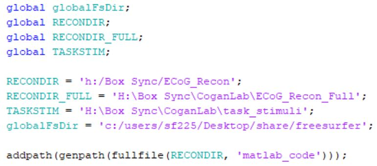

# Freesurfer
## Initial Setup (Only needs to be done in the beginning)

### Virtual Box Setup

WINDOWS

1. Copy xubuntu16 folder to C:\Users\[your username]\VirtualBox VMs
2. Run Oracle VM Virtualbox
3. Tools > Add > navigate to C:\Users\[your username]\VirtualBox VMs\ xubuntu16.vbox
4. Right click newly added VM > Settings 
5. Under Shared Folders, remove the C:\Users\sf225\Desktop\share
6. Create and add your own share folder
   1. This share folder should be on the hard drive with a generous amount of space (~500 Mb per subject)
   2. Access full, auto mount yes 
7. Note the VM is already setup and installed with Freesurfer, FSL, and Matlab 
   1. Username: sbf
   2. Passwork: SpeecH422 

### Other Required Software

#### WINDOWS

1. MDicom: [http://www.microdicom.com/downloads.html](http://www.microdicom.com/downloads.html)
2. Mricrogl: [https://www.nitrc.org/projects/mricrogl](https://www.nitrc.org/projects/mricrogl)
3. Bioimageduite 3 (legacy) [https://medicine.yale.edu/bioimaging/suite/lands/downloads/](https://medicine.yale.edu/bioimaging/suite/lands/downloads/)
   1. Windows (VS 2008) Complete Version Default 
   2. Username: anonymous 
   3. Password: bioimagesuite 
4. Matlab 

## MRI and CT Preparation

### Prepare MRI and CT volumes for Processing

#### WINDOWS

1. Create a folder on your desktop called "mri"
2. In this folder create a subject folder, e.g. "D#"
3. Copy the MRI and CT .zip files for the subject into this newly created folder
   1. Greg will place these .zip files on the neurosurgery shared drive, under the folder MRIs 
   2. Update: MRIs may need to be accessed in PACE* 

4. Extract all zip files into this directory 

   1. Do not create subfolder during extraction, all *.dcm files should be in mri/D#/

5. Open MicroDicom.exe 
6. File > Scan for DICOM files and point to the mri/D# directory 
7. Identify which scan to use for the MRI reconstruction and CT 

   1. For MRI: ax spgr scan without contrast 

8. Use dcm2niix.exe to convert dicom files to .nii

   1. Open command prompt/powershell in subject directory (shift + right click in folder > Open powershell here)
   2. Type c:/users/[YOUR USER]/Desktop/MRIcroGL/dcm2niix.exe "."

9. This will convert all volumes into .nii files 

   1. The axial D# without contrast: D#_ax_spgr_#.nii
   2. The one with the contrast usually has a "+c" in the file name
   3. For CT, it usually has _HEADAX_ in the file name
   4. Select the file with the most slices (use mDicom to check which file) 

10. Create a subject folder on the virtual machine shared folder

    1. share/mri/D#
    2. Copy the CT and MRI *.nii files there and rename to "D#_MRI.nii" and "D#_CT.nii" 

#### LINUX 

1.  Run xubuntu16 VM (Oracle Virtualbox) (user: sbf    Password: SpeecH422)
2.  In VM, navigate to the share/mri/D# folder
3.  Open command line in that folder, and type "freeview D#_MRI.nii" 
4.  Make adjustments so that the volume is anterior-commissure and posterior-commissure (AC/PC) aligned 

 

1. Tools > Transform Volume > Rotate
2. AC/PC should be aligned horizontally. Examples of what the AC/PC are at the bottom of the page; they are distinct white matter tracks in the center of the brain
3. Read more about the alignment process in "[Semi-automated Anatomical Labeling and Inter-subject Warping of High-Density Intracranial Recording Electrodes in Electrocortigraphy](https://www.ncbi.nlm.nih.gov/pmc/articles/PMC5671481/)"
4. As the last step of the procedure, the anterior commissure should be aligned at the origin of the volume. Manually enter coordinates (0,0,0) in the Right Anterior Superior (RAS) box at the bottom left of the freeview window and press Enter. This will move the **cursor** to 0,0,0

   1. Do not click anywhere on the volume, otherwise the cursor coordinates will non-zero.
   2. The use Tools > Transform Volume > Translate to move the volume to the cursor position 

5. The end result should look like the above image. The red + cursor should be over the AC (check all 3 panels) and the RAS coordinates in the lower left should read 0,0,0
6. Save the volume as "D#_MRI_ACPC.nii"     

## Recon-all

#### LINUX

1. In command terminal (current directory in share/mri/D#/) type the following the press enter

   1. recon-all -cw256 -s D# -i D#_MRI_acpc.nii -all -localGI
   2. This will take ~5 hours to complete
   3. Should say "Finished without error" in the terminal 

2. To view reconstructions results, type freeview in to the command line
3. File > Load Volume and navigate to /home/sbf/Desktop/freesurfer/D#/mri/T1.mgz

   1. File > Load Surface and navigate to /home/sbf/Desktop/freesurfer/D#/surf/lh.pial
   2. Same process for rh.pial. 

## Align CT to MRI

#### LINUX

1.  Open a command terminal in /home/sbf/Desktop/share/mri/D#, type: ct2mri.sh D# D#_CT.nii
2.  This will take about 10 minutes to run, after which results will automatically display on the screen
3.  The red lines should follow the contour of the CT and MRI, respectively

 

1.  Note, you don't need to wait for recon-all to finish before running ct2mri.sh, but recon-all should be started and running for about 20 minutes
2.  The program outputs /home/sbf/Desktop/D#/elec_recon/postInPre.nii.gz
3.  This CT is now in the same orientation and space as the freesurfer results. 

## Copy Files to Windows/VM Shared Folder

#### LINUX

1. Freesurfer recon-all cannot save results to the share directly, because Windows share does not support symlinks and the program will halt. Thus, we must copy the freesurfer results to the share/freesurfer directory so that we can access the results from Windows
2. In the command line terminal under /home/sbf/Desktop/freesurfer type:

   1. python symlink2copy.py D#
   2. cp -R D# /home/sbf/Desktop/share/freesurfer 

## BioImage Suite Labeling

#### WINDOWS

1.  Open BioImageSuite 3 (legacy version)
2.  Editors tab > Electrode Editor
3.  One Electrode Editor window, File > Load and navigate to share/freesurfer/D#/elec_recon/postInPre.nii.gz
4.  On the right side of the main window, configure to match the following:

1. Image Processing > Threshold > Threshold Image
2. Set low threshold to 2000 and click Threshold Image at the bottom. You should now see a 3D cube with electrodes visible
   1. Left click and hold to rotate
   2. Middle mouse button and hold to zoom
   3. Right click and hold to translate volume

 

1. Open Electrode Control Window
2. Volume Trace > VOL Size 5 
3. Edit the first grid by clicking Electrode Info tab 

   1. Change dimensions to 1 X 12 (or however many you need) and click Update Grid. A message will notify you the grid dimensions will change
   2. Grid > Grid color > choose a distinguishing color 
   3. Edit > Full Edit Mode
   4. Start with the bottom electrode (electrode 1, which is the electrode furthest from the scalp)

     

   1.  Check the Button Pick on the right, and click Pick Current
   2.  Go to the main window and Shift + Left click to place electrode 

     

1. Go to Patient Info tab and click Add New Grid 
2. Repeat the above procedure to label electrodes for this grid/depth/strip
3. You will need to save each grid/depth/strip with the right naming convention

 

1. Enter grid/depth/strip name here and press Update Grid
2. Depth = LD_ or RD_ for left and right hemispheres, respectively
3. Grids = LG_ or RG_
4. Strips = LS_ or RS_ 
5. You will need to get information about naming from the neurologist or neurosurgeon notes or by looking at the EDF headers of task data
6. Tips:

   1. If electrodes aren't distinguishable in 3D mode, sometimes they appear better in 2D mode

      1. Set low threshold to 0
      2. Use Simple Mode in the main panel

      

   2. There is a bug in 2D mode: when you want to edit a grid/depth/strip, it is easy to accidentally move an electrode unintentionally. After selecting a grid, do not click on the main panel without first clicking the Release button (shown below):

      

   3. If you accidentally move an electrode, click Edit > Undo Move Electrode in the Electrode Control window
   4. Check the electrode spacing 
   5. Use auto-warp to extrapolate locations. Sometimes you can distinguish the first 4 or 5 contacts (nearest center of brain), but as the depth approaches the skull, it often gets washed out. Bioimage suite has an auto-warp function that will extrapolate the remaining unplaced electrodes on a given grid/depth/strip
   6. Electrode Control panel > Grid > Auto Warp
   7. When finished, click File > Save in the Electrode Control panel. Save as share/freesurfer/D#/elec_recon/D#.mgrid 

## Matlab Scripts after labeling

WINDOWS

1. First time setup

   1. Matlab startup.m script should set the following global variables

    

   2. Your paths will be specific to your machine and setup 

2. Run: `freesurfer_preprocessing('D#')`
3. Run: `freesurfer_print_elec_slices('D#')`
4. Test results with `plot_subj('D#')`. You should see pial surface rendering with the correct location and names of labeled electrodes 
5. Files should be automatically saved to ECoG_Recon  (check that Box Sync is syncing the files)