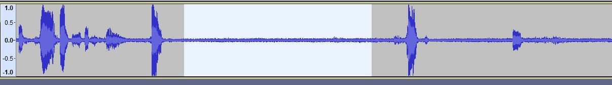
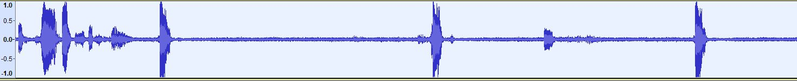
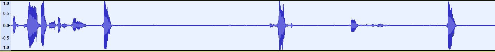
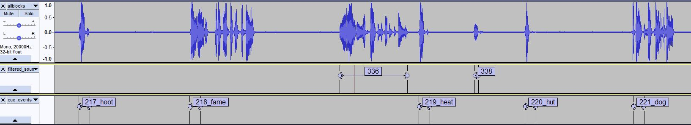

# Response Coding
## Required software:

*   Matlab
*   Audacity ([https://www.audacityteam.org/download/](https://www.audacityteam.org/download/) )

## Preparing audio files  

1. Go to the subject directory on Box/CoganLab/ECoG_Task_Data/Cogan_Task_Data/
2. Copy the block-recording (*_AllTrials.wav) into a temporary directory
3. Rename these blocks to block1.wav, block2.wav. etc.

   1. D##_Block_1_AllTrials.wav would be renamed to **block1**.wav
   2. D##_Block_2_AllTrials.wav would be renamed to **block2**.wav
   3. D##_Block_3_AllTrials.wav would be renamed to **block3**.wav
   4. D##_Block_4_AllTrials.wav would be renamed to **block4**.wav 

4. Copy *_TrialData.mat into same directory and rename to **trialInfo**.mat 

   1. D##_Block_1_TrialData would be renamed to **trialInfo**.mat
   2. If there are multiple *.mat files, copy the one with the highest block number
   3. _If the task is split across multiple recordings, then combine trialInfo files into one_

      1. Copy each *TrialData.mat and rename to trialInfo1.mat, trialInfo2.mat, etc.
      2. Run **fix_trialInfo_blocks('trialInfo1.mat', [1 2]);**

         1. [1 2] refer to the blocks that the trialInfo1.mat file _should_ contain.
         2. Sometimes trialInfo has extra trials before the session was terminated, and this script will remove those extra trials. 

      3. Run **fix_trialInfo_blocks('trialInfo2.mat', [3 4]);**

         1. Or whatever the blocks _should_ be 

      4. Run **combine_trialInfo** 
      5. A single trialInfo.mat file that combined trialInfo1.mat and trialInfo2.mat together
      6. Double click trialInfo.mat to load it
      7. Type **trialInfo = cellfun(@(a) a, trialInfo);** to convert to structure for easier examination. Ensure all blocks are present and named appropriately 

5. Run Matlab 

   1. **X = 'H:\Box Sync\CoganLab\ECoG_Task_Data\response_coding\response+coding_dep';** (individual path may be different)
   2. Type into Matlab command line, **addpath(genpath(X)); **

6. In Matlab, navigate to the directory with the *.wavs 
7. Run **combine_wavs **
8. A file allblocks.wav should be generated in that same directory 
9. Drag and drop the allblocks.wav into Audacity main window

| **Control&nbsp;**               | **Function&nbsp;**                                                            |
|---------------------------------|-------------------------------------------------------------------------------|
| Ctrl + mouse wheel&nbsp;        | Zoom&nbsp;                                                                    |
| Shift + mouse wheel&nbsp;&nbsp; | Pan left or right&nbsp;                                                       |
| Left click + drag&nbsp;         | Highlight portion of wav file&nbsp;                                           |
| Ctrl + B&nbsp;&nbsp;            | Label the selected portion (*Select text and Backspace to remove label)&nbsp; |
| Spacebar                        | Play selected portion                                                         |
| Shift + left click              | Extend selected portion                                                       |
| Up/Down arrow                   | Select different tracks (Current selected track is outlined in yellow)        |
| Tab + Shift + Tab               | Navigate through labels (when label track selected)                           |
| Ctrl + S                        | Save project                                                                  |

**Do not use Control + Z ****to undo changes to labels.** Modifying labels (adjusting onset or offset, or changing text) are lumped into a single History level. A single Control + Z can undo all of these lumped modifications. Control + Y will redo 

## Response Coding Guidelines

1. Precisely denote onset of voice and offset of voice
2. For "Just Listen" trials, do not put a label during the response epoch
3. For "Repeat" trials, just put a number for the label
4. For "Yes/No" trials, include "yes" or "no" in the label text
5. If the epoch or trial is noisy, include "noisy" in the label text
6. You can have multiple tags, e.g. "1_yes_noisy" can be a valid label
7. Noisy trials indicate a significant amount of background noise, or the response is unclear and not discernible
8. If they miss trials, just leave the response blank
9. Focus on getting the sound onset correct
10. If the ending of the word is not discernible, extrapolate to where the end should be (i.e. can't hear the ending "t" in "rabbit", extrapolate to where you think it should be)
11. For "yes" responses, don't worry about getting the final "s" sound, as it slows down the coding too much. However, words ending in "s" that are repeated should have an accurate offset. 
12. To save results, close any label tracks that are not the response coding (Cue track). When you export labels in Audacity, it will export all label tracks into a single file, so make sure only the relevant label track is loaded.
13. File > Export > Export Labels  and save as "response_coding.txt." 
14. **Copy the following files to Box under [subj]_task[tasknumber] /folder**

    1. **allblocks.wav (wav w/ noise reduction)***
    2. **allblocks_orig.wav (original wav file, unedited)**
    3. **block_wav_onsets.mat**
    4. **cue_events.txt**
    5. **filtered_sound_finder_results.txt**
    6. **first_stims.txt**
    7. **response_coding.txt**
    8. **sound_finder_results.txt**
    9. **trialInfo.mat**
    10. **condition_events.mat**

* On box, if only allblocks.wav is uploaded, that is the original/unedited wav file- noise reduction was not required.  

 

## To Speed Up Coding

1. The following steps can accelerate coding, and should start after loading the allblocks.wav in Audacity
2. Filter noise from wav file

   1. Highlight a quiet portion of allblock.wav (around half a second)

        

   2. Effect > Noise Reduction
   3. Click Get Noise Profile 
   4. Highlight the entire wav (double click any part of the wav to select the whole track)

        

   5. Effect > Noise Reduction
   6. The default settings should be fine, but you can adjust the settings to achieve better results

      1. Noise reduction: 9
      2. Sensitivity: 6
      3. Frequency smoothing: 3 

   7. Click OK. The wav file should be clean 

        

3. Sound Finder 

   1. Highlight the entire wav (double click any part of the wav/ctrl 'A' to select the whole track)
   2. Analyze > Label Sounds... This will output labels where sound occurs.  
   3. The first setting may need to be adjusted to achieve desired results 

     

     *(-30 dB is a good starting point, closer to -100 is more sensitive)

     *Label text: Delete "Sound" 

4. File > Export > Export Labels and save as "**sound_finder_results**.txt" 
5. Close the label track by clicking the x on the left side
6. Highlight the first auditory stimulus (not the response of the participant or the tone, the actual stimulus)
7. CTRL + B to create a label, call it 1\. Repeat this for Block 2 ... Block _n_
8. File > Export > Export Labels and save as "**first_stims**.txt"
9. In Matlab, run **make_cue_events**, then run **filter_sound_finder_results**. This creates two files:

   1. cue_events.txt
   2. filtered_sound_finder_results.txt 

10. Run: **make_condition_events** 
11. In Audacity, close any label tracks 
12. File > Import > Labels. Select filtered_sound_finder_results.txt
13. File > Import> Labels. Select cue_events.txt

    1. The filtered_sound_finder_results is a label track that should only include the results of the sound finder, except now the stimulus voices are filtered out. 
    2. What should be left is hopefully labels for each participant response. You will still need to navigate through each response and modify, delete, or add labels for each trial, as the results will not be perfect.
    3. The cue_events label track is there to just help you navigate and denote which trial stimulus was played.
    4. As seen above, the middle track is the auto-generated responses from the sound finder.
    5. You will need to go through each one and verify the begin and end point, and adjust as needed

       

    6. If sound finder results are not very good, repeat the Sound Finder steps with a different parameter.