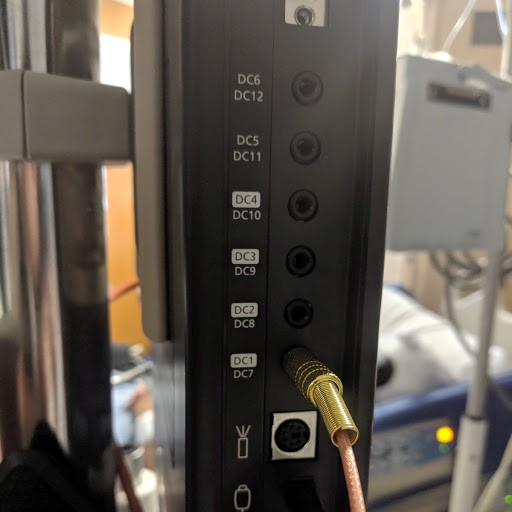
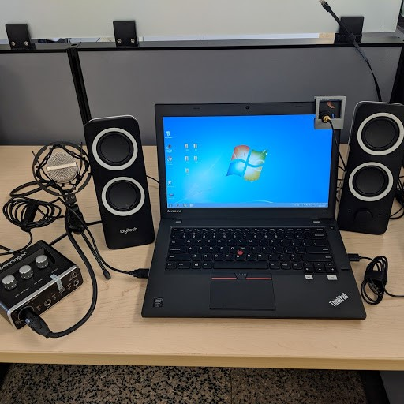

# Setup
## **Initial Setup**

1. Approximately 48 hours after the operation, contact an ECoG tech to help install the research cables
2. Research cables:

3. Trigger cable (photo diode): DC1 (request the gain to be 10 mV)
4. Audio cable: the next 2 available channels (we have reservations on Box 1) 

   1. The gain for the trigger cable should be sensitive enough to be able to clearly see the triggers (10 mV is the ideal setting)
   2. The gain for the audio cables should be the same as the other channels
   3. Run playbeeps.m to test the triggers and verify you can clearly see the triggers on the screen (Zeus PC>C:\Psychtoolbox_Scripts\playbeeps) 
   4. Note when the system restarts--you want to avoid running a task when the system reboots as this will cut out data. You can view the reset time in top header.

## Standard Data Collection

1.  Unplug the bed from the wall and disable any alarms (you may need to get the help from the nurse) 
2.  Run a practice task in the lab to verify the task is functioning
3.  In the audio manager verify the playback device is default to the FIO amplifier 
4.  Connect the photo diode to the BNC cable (peach colored) and plug that cable into DC1 input.

 

1.  Connect the audio cable with the BNC connector with the audio input. 
2.  The following diagram is the overall setup for traditional auditory tasks:

1.  The microphone amplifier should be setup as follows:

 

1.  Verbally explain the task to the participant (this is where scripts come in handy) and run a practice block with the participant 
2.  Give feedback to the participant to ensure the task is being correctly done (i.e. waiting for the Speak cue). Use positive encouragement when he/she does the practice correctly!
3.  Make note of the time of recording for the start and end of blocks in the ECoG notebook
4.  At the conclusion of the task, thank the participant and give him/her an estimate of when you will return for another task.
5.  Remove all research equipment and store in the box.  

## Finished with overall data collection

1.  Thank the participant for their involvement in the research study.
2.  Ask an ECoG tech to remove the research audio cables from the box.