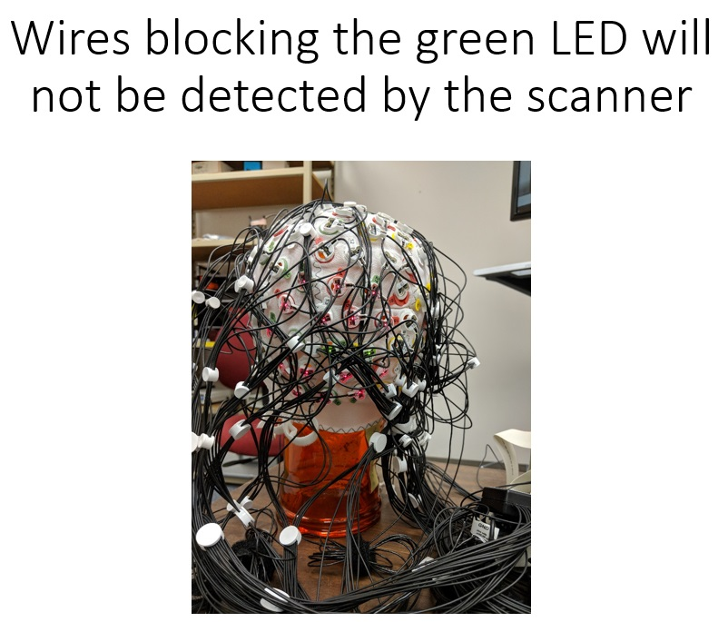
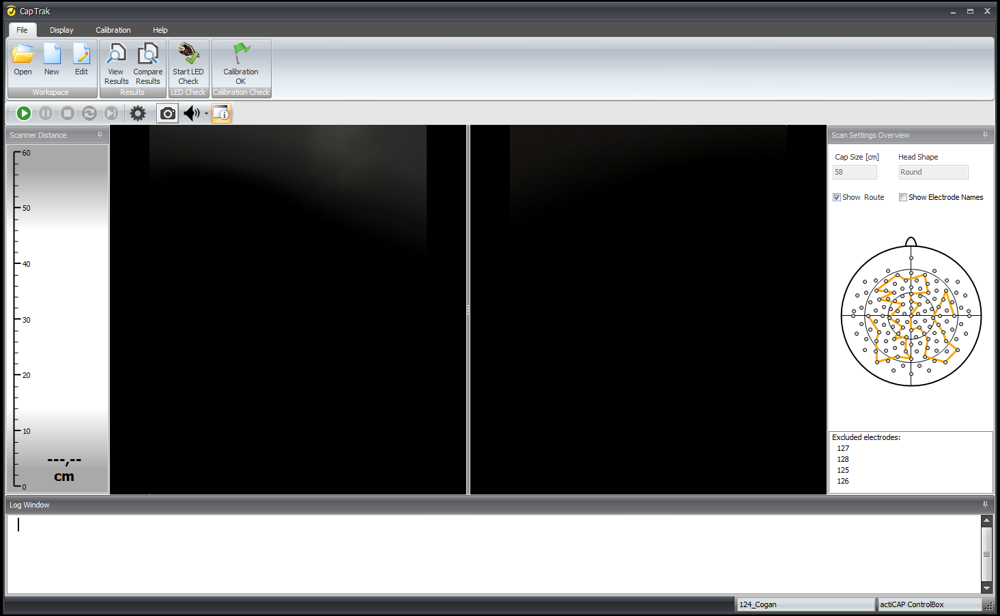
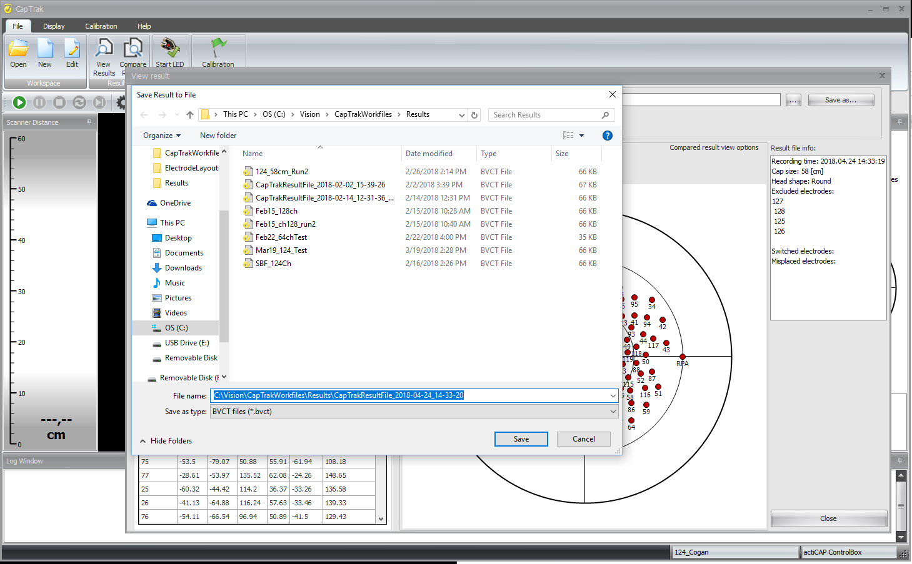

**Hardware Setup**

1.  Insert electrodes into the holders and align wires to avoid blocking the surface of the LED. 
2.  Plug REF into the ActiChamp control box and electrode into the head cap
3.  GND should be inserted into the GND distributor, and then the GND jumper cable should go from the GND distributor to the GND on the control box. 
4.  The three fiducials should be placed at naison, LPA, and RPA. Use the holders and double-sided adhesives to attach to the head.
5.  Plug the ribbon cables into the input connectors of the ActiChamp control box. 
6.  Plug the micro USB cable into the port. This port is on the inside of the control box (may have to remove batteries/power pack to get to this port) 

 

**Software Setup **

1.  Click on the CapTrak icon and launch the application to view the main menu

 

1.  Option 1: New Workspace> Load electrode position file > CACS-128-X2_M14_til_128.bvef > Remove electrodes: 125, 126, 127, and 128 >Select ActiChap control box > Name and save new workspace
2.  Option 2: Open workspace > continue using established workspace. Use this workspace when using the 124 channel head caps: **[124ch_Cogan](Open_WS_Cogan.png)**
3.  Click Start Scan

**Operation**

1.  The scanner should be held approximately 30 cm from the head. A beep  will play if the distance of the scanner is too close or too far. This auditory feedback can be turned off. 
2.  Two green LED lights will be displayed on the cap. Orient the scanner to be parallel to the green lights. You may have to rotate the scanner to detect the green lights. 
3.  Once the scanner detects the green lights, a chime will play and then two new green LEDs will be lit. Repeat the step of orienting the scanner to pick up the lights until the entire head has been scanned. 
4.  A progress bar on the right hand side of the screen will indicate how much of the cap is left to scan. 
5.  Troubleshooting: [Wires may need to be moved to the side for the LED to be detected](Wire_Organization2.jpg). Wires blocking the surface of the electrode may yield the message "Green light not detected"
6.  A chime will signal the complete scan and a dialog box will appear to save the scanned file. Save the file with this format: **[ParticipantID]_124ch**
7.  Files can be [saved as](ExportAs.png) the following:

*   .bvct (ideal to use with Brain Vision Analyzer)
*   .txt
*   .sfp (BESA)
*   .csv 

 

**Troubleshooting**

1.  Observed 180222:

1.  During scanning in work space ActiChamp_64 (Appelbaum head caps) two electrodes started to blink simultaneously. Error message "59 and 61 are switched. Continue?". Captrak system encountered this error due to the electrodes in the wrong location in the head cap. The electrodes were switched to match the location layout specified in the work space. Repeated scans did not yield error message.  

3.  Observed 180222 & 180226 

1.  Error message "Naison landmark not detected" appeared at the end of the scan.
2.  Repeat of scan required with an emphasis on detecting the Nz landmark. *The Nz landmark was plugged into the ground distributor and attached to the glass head. 
3.  Error message appeared after the 2nd scan. The Nz was removed from the ground distributor and then plugged back in. 
4.  The scan of the head was repeated, and the error message did not appear at the end of the 3rd scan.
5.  Suggested solutions: leave the landmark electrodes unplugged when not in use, and then plug into the ground distributor prior to scanning the head.